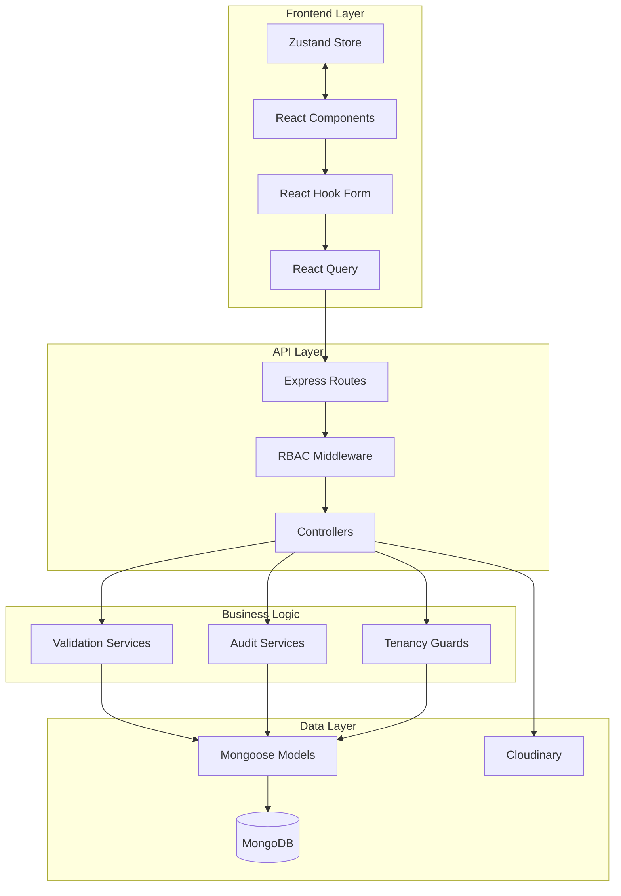
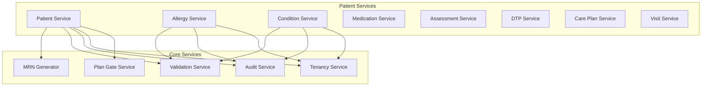

# Patient Management Module Design

## Overview

The Patient Management module is a comprehensive feature for the Pharma-Care-SaaS platform that enables pharmacists and pharmacy staff to efficiently manage patient records, clinical information, medications, allergies, conditions, and care plans. The module implements a multi-tenant, role-based system following Nigerian healthcare practices and regulatory requirements.

## Technology Stack & Dependencies

### Backend

- **Node.js/Express.js** with TypeScript
- **MongoDB** with Mongoose ODM
- **Zod** for server-side validation
- **JWT** for authentication
- **Cloudinary** for file storage

### Frontend

- **React 18** with TypeScript
- **Material-UI (MUI)** for UI components
- **React Router v6** for navigation
- **React Query** for state management
- **React Hook Form** with Zod resolver
- **Zustand** for global state

## Architecture

### Data Flow Architecture



### Component Hierarchy

```mermaid
graph TD
    PMM[Patient Management Module]

    PMM --> PLP[Patient List Page]
    PMM --> PCF[Patient Create Form]
    PMM --> PPP[Patient Profile Page]
    PMM --> VFS[Visit Form SOAP]

    PLP --> PSB[Patient Search Bar]
    PLP --> PTB[Patient Table]
    PLP --> PAG[Pagination]

    PCF --> DEM[Demography Section]
    PCF --> ALL[Allergies Section]
    PCF --> CON[Conditions Section]
    PCF --> MED[Medications Section]
    PCF --> ASS[Assessment Section]
    PCF --> DTP[DTP Section]
    PCF --> CPL[Care Plan Section]

    PPP --> OVW[Overview Tab]
    PPP --> ALT[Allergies Tab]
    PPP --> CNT[Conditions Tab]
    PPP --> MDT[Medications Tab]
    PPP --> AST[Assessments Tab]
    PPP --> DTT[DTPs Tab]
    PPP --> CPT[Care Plans Tab]
    PPP --> VIT[Visits Tab]
```



## Data Models & ORM Mapping

### Core Patient Model

```typescript
interface IPatient {
  _id: ObjectId;
  pharmacyId: ObjectId; // Multi-tenant identifier
  mrn: string; // Medical Record Number (PHM-{pharmacyCode}-{00001})

  // Demographics
  firstName: string;
  lastName: string;
  otherNames?: string;
  dob?: Date;
  age?: number;
  gender?: 'male' | 'female' | 'other';
  phone?: string; // E.164 format (+234...)
  email?: string;
  address?: string;
  state?: string; // Nigerian states
  lga?: string; // Local Government Area
  maritalStatus?: 'single' | 'married' | 'divorced' | 'widowed';
  bloodGroup?: 'A+' | 'A-' | 'B+' | 'B-' | 'AB+' | 'AB-' | 'O+' | 'O-';
  genotype?: 'AA' | 'AS' | 'SS' | 'AC' | 'SC' | 'CC';
  weightKg?: number;

  // Clinical Cache
  latestVitals?: {
    bpSystolic?: number;
    bpDiastolic?: number;
    rr?: number;
    tempC?: number;
    heartSounds?: string;
    pallor?: 'none' | 'mild' | 'moderate' | 'severe';
    dehydration?: 'none' | 'mild' | 'moderate' | 'severe';
    recordedAt?: Date;
  };
  hasActiveDTP?: boolean;

  // Audit & Soft Delete
  isDeleted: boolean;
  createdBy: ObjectId;
  updatedBy?: ObjectId;
  createdAt: Date;
  updatedAt: Date;
}
```

### Related Models

```typescript
// Allergy Model
interface IAllergy {
  _id: ObjectId;
  pharmacyId: ObjectId;
  patientId: ObjectId;
  substance: string;
  reaction?: string;
  severity?: 'mild' | 'moderate' | 'severe';
  notedAt?: Date;
  // Audit fields (createdBy, updatedBy, isDeleted, timestamps)
}

// Medical Condition Model
interface ICondition {
  _id: ObjectId;
  pharmacyId: ObjectId;
  patientId: ObjectId;
  name: string;
  snomedId?: string;
  onsetDate?: Date;
  status?: 'active' | 'resolved' | 'remission';
  notes?: string;
  // Audit fields
}

// Medication Record Model
interface IMedicationRecord {
  _id: ObjectId;
  pharmacyId: ObjectId;
  patientId: ObjectId;
  phase: 'past' | 'current';
  medicationName: string;
  purposeIndication?: string;
  dose?: string;
  frequency?: string;
  route?: string;
  duration?: string;
  startDate?: Date;
  endDate?: Date;
  adherence?: 'good' | 'poor' | 'unknown';
  notes?: string;
  // Audit fields
}

// Clinical Assessment Model
interface IClinicalAssessment {
  _id: ObjectId;
  pharmacyId: ObjectId;
  patientId: ObjectId;
  visitId?: ObjectId;
  vitals?: IPatientVitals;
  labs?: {
    pcv?: number;
    mcs?: string;
    eucr?: string;
    fbc?: string;
    fbs?: number;
    hba1c?: number;
    misc?: Record<string, string | number>;
  };
  recordedAt: Date;
  // Audit fields
}

// Drug Therapy Problem Model
interface IDrugTherapyProblem {
  _id: ObjectId;
  pharmacyId: ObjectId;
  patientId: ObjectId;
  visitId?: ObjectId;
  type:
    | 'unnecessary'
    | 'wrongDrug'
    | 'doseTooLow'
    | 'doseTooHigh'
    | 'adverseReaction'
    | 'inappropriateAdherence'
    | 'needsAdditional';
  description?: string;
  status: 'unresolved' | 'resolved';
  resolvedAt?: Date;
  // Audit fields
}

// Care Plan Model
interface ICarePlan {
  _id: ObjectId;
  pharmacyId: ObjectId;
  patientId: ObjectId;
  visitId?: ObjectId;
  goals: string[];
  objectives: string[];
  followUpDate?: Date;
  planQuality: 'adequate' | 'needsReview';
  dtpSummary?: 'resolved' | 'unresolved';
  notes?: string;
  // Audit fields
}

// Visit (SOAP) Model
interface IVisit {
  _id: ObjectId;
  pharmacyId: ObjectId;
  patientId: ObjectId;
  date: Date;
  soap: {
    subjective?: string;
    objective?: string;
    assessment?: string;
    plan?: string;
  };
  attachments?: [
    {
      kind: 'lab' | 'image' | 'audio' | 'other';
      url: string;
      uploadedAt: Date;
    }
  ];
  // Audit fields
}
```

### Database Indexes

```typescript
// Patient Model Indexes
{ pharmacyId: 1, mrn: 1 } // Unique compound index
{ pharmacyId: 1, lastName: 1, firstName: 1 } // Search optimization
{ pharmacyId: 1, isDeleted: 1 } // Soft delete filtering
{ pharmacyId: 1, phone: 1 } // Phone search

// Related Models Indexes
{ pharmacyId: 1, patientId: 1 } // All related models
{ pharmacyId: 1, patientId: 1, isDeleted: 1 } // Soft delete queries
```

## API Endpoints Reference

### Patient Management Endpoints

```http
# Core Patient Operations
POST   /api/patients                    # Create patient
GET    /api/patients                    # List patients with search/pagination
GET    /api/patients/:id                # Get patient details
PATCH  /api/patients/:id                # Update patient
DELETE /api/patients/:id                # Soft delete patient

# Patient Sub-resources
POST   /api/patients/:id/allergies      # Add allergy
GET    /api/patients/:id/allergies      # List patient allergies
PATCH  /api/allergies/:allergyId        # Update allergy
DELETE /api/allergies/:allergyId        # Delete allergy

POST   /api/patients/:id/conditions     # Add condition
GET    /api/patients/:id/conditions     # List patient conditions
PATCH  /api/conditions/:conditionId     # Update condition
DELETE /api/conditions/:conditionId     # Delete condition

POST   /api/patients/:id/medications    # Add medication record
GET    /api/patients/:id/medications    # List medications (?phase=current|past)
PATCH  /api/medications/:medId          # Update medication
DELETE /api/medications/:medId          # Delete medication

POST   /api/patients/:id/assessments    # Add assessment
GET    /api/patients/:id/assessments    # List assessments
PATCH  /api/assessments/:assessmentId   # Update assessment

POST   /api/patients/:id/dtps           # Add DTP
GET    /api/patients/:id/dtps           # List DTPs (?status=resolved|unresolved)
PATCH  /api/dtps/:dtpId                 # Update DTP

POST   /api/patients/:id/careplans      # Add care plan
GET    /api/patients/:id/careplans      # List care plans
PATCH  /api/careplans/:carePlanId       # Update care plan

POST   /api/patients/:id/visits         # Create visit
GET    /api/patients/:id/visits         # List patient visits
GET    /api/visits/:visitId             # Get visit details
PATCH  /api/visits/:visitId             # Update visit
POST   /api/visits/:visitId/attachments # Upload attachment
```

### Authentication Requirements

All endpoints require JWT authentication:

```http
Authorization: Bearer <jwt_token>
X-Pharmacy-ID: <pharmacy_id>
```

### Request/Response Schema

#### Create Patient Request

```json
{
  "demography": {
    "firstName": "Ada",
    "lastName": "Okoro",
    "dob": "1992-05-11",
    "gender": "female",
    "phone": "+2348012345678",
    "state": "Lagos",
    "lga": "Ikeja",
    "maritalStatus": "single",
    "bloodGroup": "O+",
    "genotype": "AS",
    "weightKg": 64
  },
  "allergies": [
    {
      "substance": "Amoxicillin",
      "reaction": "Rash",
      "severity": "moderate"
    }
  ],
  "conditions": [
    {
      "name": "Hypertension",
      "status": "active"
    }
  ],
  "medications": [
    {
      "phase": "current",
      "medicationName": "Amlodipine 5mg",
      "purposeIndication": "HTN",
      "dose": "5mg",
      "frequency": "od",
      "route": "PO",
      "startDate": "2025-08-01"
    }
  ],
  "assessment": {
    "vitals": {
      "bpSys": 140,
      "bpDia": 90,
      "rr": 18,
      "tempC": 36.9,
      "pallor": "none",
      "dehydration": "none"
    },
    "labs": {
      "pcv": 35,
      "fbs": 98,
      "hba1c": 5.4
    }
  },
  "dtps": [
    {
      "type": "doseTooHigh",
      "description": "Consider reducing dose if dizziness persists",
      "status": "unresolved"
    }
  ],
  "carePlan": {
    "goals": ["Reduce BP < 130/80", "Improve adherence"],
    "objectives": ["Daily BP log", "Lifestyle advice", "Follow-up in 2 weeks"],
    "followUpDate": "2025-09-10",
    "planQuality": "needsReview",
    "dtpSummary": "unresolved"
  }
}
```

## Business Logic Layer (Architecture of each feature)

### Patient Service Architecture



### Core Business Rules

#### MRN Generation

```typescript
// Format: PHM-{pharmacyCode}-{sequentialNumber}
// Example: PHM-LAG-00001, PHM-ABJ-00157
```

#### Subscription Plan Gates

```typescript
interface PlanLimits {
  freeTrial: { maxPatients: 50 };
  basic: { maxPatients: 200 };
  pro: { maxPatients: 1000 };
  enterprise: { maxPatients: -1 }; // Unlimited
}
```

#### RBAC Permissions

```typescript
interface RolePermissions {
  owner: ['create', 'read', 'update', 'delete'];
  pharmacist: ['create', 'read', 'update', 'delete'];
  technician: ['read', 'create_assessment'];
  admin: ['read_all', 'update_all']; // Cross-tenant
}
```

## Middleware & Interceptors

### RBAC Middleware

```typescript
// requireRole(['owner', 'pharmacist']) - for patient CRUD
// requireRole(['technician']) - for assessment creation
// requireRole(['admin']) - for cross-tenant access
```

### Tenancy Guard Middleware

```typescript
const tenancyGuard = (req: AuthRequest, res: Response, next: NextFunction) => {
  req.tenancyFilter = {
    pharmacyId: req.user.pharmacyId,
    isDeleted: false,
  };
  next();
};
```

### Validation Middleware

```typescript
// Zod schemas for each endpoint
const createPatientSchema = z.object({
  demography: z.object({
    firstName: z.string().min(2).max(50),
    lastName: z.string().min(2).max(50),
    phone: z
      .string()
      .regex(/^\+234[789][01]\d{8}$/)
      .optional(),
    // ... other fields
  }),
  allergies: z.array(allergySchema).optional(),
  // ... other sections
});

// Returns 422 with detailed validation errors
```

### Audit Middleware

```typescript
const auditMiddleware = (
  req: AuthRequest,
  res: Response,
  next: NextFunction
) => {
  if (req.method === 'POST') {
    req.body.createdBy = req.user._id;
  }
  if (req.method === 'PATCH') {
    req.body.updatedBy = req.user._id;
    req.body.updatedAt = new Date();
  }
  next();
};
```

## Component Architecture

### Patient List Page

```typescript
interface PatientListProps {
  onPatientSelect: (patientId: string) => void;
  onCreatePatient: () => void;
}

// Features:
// - Search by name, MRN, phone
// - Filter by gender, state, active DTPs
// - Pagination
// - Bulk actions
// - Export functionality
```

### Patient Create Form

```typescript
interface PatientCreateFormProps {
  onSuccess: (patient: IPatient) => void;
  onCancel: () => void;
}

// Form Sections:
// 1. Demographics (required fields validation)
// 2. Allergies (dynamic array with severity)
// 3. Conditions (SNOMED code lookup)
// 4. Current/Past Medications
// 5. Clinical Assessment (vitals + labs)
// 6. DTPs (checklist with descriptions)
// 7. Care Plan (goals/objectives arrays)
```

### Patient Profile Tabs

```typescript
const profileTabs = [
  { label: 'Overview', component: PatientOverview },
  { label: 'Allergies', component: AllergiesTab },
  { label: 'Conditions', component: ConditionsTab },
  { label: 'Medications', component: MedicationsTab },
  { label: 'Assessments', component: AssessmentsTab },
  { label: 'DTPs', component: DTPsTab },
  { label: 'Care Plans', component: CarePlansTab },
  { label: 'Visits', component: VisitsTab },
];

// Each tab supports:
// - CRUD operations
// - Optimistic updates
// - Real-time validation
// - Accessibility features
```

### SOAP Visit Form

```typescript
interface SOAPFormProps {
  patientId: string;
  visitId?: string; // For editing existing visits
  onSave: (visitData: IVisit) => void;
}

// Form Structure:
// - Subjective: Multi-line text with character count
// - Objective: Structured vitals + free text
// - Assessment: Diagnosis selection + notes
// - Plan: Treatment plan + follow-up
// - Attachments: Cloudinary upload widget
```

## Routing & Navigation

### Route Structure

```typescript
const patientRoutes = {
  list: '/patients',
  create: '/patients/new',
  profile: '/patients/:id',
  edit: '/patients/:id/edit',
  visit: '/patients/:id/visit/new',
  visitEdit: '/patients/:id/visit/:visitId/edit',
};

// Navigation Flow:
// Sidebar "Patient Management" → List → Create/View/Edit
// Patient Profile → Tabs → New Visit → SOAP Form
```

### Protected Routes

```typescript
<ProtectedRoute roles={['owner', 'pharmacist']}>
  <PatientCreateForm />
</ProtectedRoute>

<ProtectedRoute roles={['technician']}>
  <AssessmentForm />
</ProtectedRoute>

<ProtectedRoute roles={['admin']} crossTenant>
  <AdminPatientList />
</ProtectedRoute>
```

## Styling Strategy (CSS-in-JS, Tailwind, etc.)

### Material-UI Theme Integration

```typescript
const patientTheme = {
  palette: {
    patient: {
      male: '#1976d2',
      female: '#d81b60',
      other: '#757575',
    },
    severity: {
      mild: '#4caf50',
      moderate: '#ff9800',
      severe: '#f44336',
    },
  },
  components: {
    MuiPatientCard: {
      styleOverrides: {
        root: {
          borderLeft: '4px solid',
          borderLeftColor: ({ theme, severity }) =>
            theme.palette.severity[severity],
        },
      },
    },
  },
};
```

### Responsive Design

```typescript
const useResponsiveLayout = () => {
  const theme = useTheme();
  const isMobile = useMediaQuery(theme.breakpoints.down('md'));

  return {
    formLayout: isMobile ? 'single-column' : 'two-column',
    tableView: isMobile ? 'card-list' : 'table',
    sidebarBehavior: isMobile ? 'drawer' : 'persistent',
  };
};
```

## State Management (Redux, Zustand, Vuex, etc.)

### React Query Configuration

```typescript
export const patientKeys = {
  all: ['patients'] as const,
  lists: () => [...patientKeys.all, 'list'] as const,
  list: (filters: PatientFilters) => [...patientKeys.lists(), filters] as const,
  details: () => [...patientKeys.all, 'detail'] as const,
  detail: (id: string) => [...patientKeys.details(), id] as const,
  allergies: (id: string) => [...patientKeys.detail(id), 'allergies'] as const,
  medications: (id: string) =>
    [...patientKeys.detail(id), 'medications'] as const,
};

export const usePatients = (filters: PatientFilters) => {
  return useQuery({
    queryKey: patientKeys.list(filters),
    queryFn: () => patientsApi.getPatients(filters),
    keepPreviousData: true,
    staleTime: 5 * 60 * 1000, // 5 minutes
  });
};
```

### Optimistic Updates

```typescript
export const useAddAllergy = () => {
  const queryClient = useQueryClient();

  return useMutation({
    mutationFn: allergiesApi.createAllergy,
    onMutate: async (newAllergy) => {
      // Optimistic update logic
      await queryClient.cancelQueries(
        patientKeys.allergies(newAllergy.patientId)
      );

      const previousAllergies = queryClient.getQueryData(
        patientKeys.allergies(newAllergy.patientId)
      );

      queryClient.setQueryData(
        patientKeys.allergies(newAllergy.patientId),
        (old: IAllergy[]) => [...(old || []), { ...newAllergy, _id: 'temp-id' }]
      );

      return { previousAllergies };
    },
    onError: (err, newAllergy, context) => {
      // Rollback on error
      queryClient.setQueryData(
        patientKeys.allergies(newAllergy.patientId),
        context?.previousAllergies
      );
    },
    onSettled: (data, error, variables) => {
      // Refetch to ensure consistency
      queryClient.invalidateQueries(patientKeys.allergies(variables.patientId));
    },
  });
};
```

### Zustand Global State

```typescript
interface PatientStore {
  selectedPatientId: string | null;
  activeTab: string;
  formState: PatientFormState;
  setSelectedPatient: (id: string | null) => void;
  setActiveTab: (tab: string) => void;
  updateFormState: (state: Partial<PatientFormState>) => void;
}

export const usePatientStore = create<PatientStore>((set) => ({
  selectedPatientId: null,
  activeTab: 'overview',
  formState: initialFormState,
  setSelectedPatient: (id) => set({ selectedPatientId: id }),
  setActiveTab: (tab) => set({ activeTab: tab }),
  updateFormState: (state) =>
    set((prev) => ({
      formState: { ...prev.formState, ...state },
    })),
}));
```

## API Integration Layer

### API Service Architecture

```typescript
const apiClient = axios.create({
  baseURL: '/api',
  headers: {
    'Content-Type': 'application/json',
  },
});

// Add auth and pharmacy interceptors
apiClient.interceptors.request.use((config) => {
  const token = localStorage.getItem('authToken');
  const pharmacyId = localStorage.getItem('pharmacyId');

  if (token) {
    config.headers.Authorization = `Bearer ${token}`;
  }
  if (pharmacyId) {
    config.headers['X-Pharmacy-ID'] = pharmacyId;
  }

  return config;
});

export const patientsApi = {
  getPatients: (filters: PatientFilters) =>
    apiClient.get('/patients', { params: filters }),

  getPatient: (id: string) => apiClient.get(`/patients/${id}`),

  createPatient: (data: CreatePatientRequest) =>
    apiClient.post('/patients', data),

  updatePatient: (id: string, data: UpdatePatientRequest) =>
    apiClient.patch(`/patients/${id}`, data),

  deletePatient: (id: string) => apiClient.delete(`/patients/${id}`),
};
```

## Testing Strategy (Jest, Cypress, etc.)

### Unit Testing (Jest)

```typescript
describe('PatientController', () => {
  it('should create patient with MRN generation', async () => {
    const mockReq = {
      user: { _id: 'user1', pharmacyId: 'pharmacy1' },
      body: { firstName: 'John', lastName: 'Doe' },
    };

    const result = await patientController.createPatient(mockReq, mockRes);

    expect(result.patient.mrn).toMatch(/^PHM-\w+-\d{5}$/);
    expect(result.patient.pharmacyId).toBe('pharmacy1');
  });

  it('should enforce plan limits', async () => {
    // Mock subscription plan with patient limit
    // Test that creation fails when limit exceeded
  });

  it('should enforce RBAC permissions', async () => {
    // Test that technician cannot delete patient
    // Test that pharmacist can create patient
  });
});

describe('PatientCreateForm', () => {
  it('should validate required fields', async () => {
    render(<PatientCreateForm onSuccess={jest.fn()} onCancel={jest.fn()} />);

    fireEvent.click(screen.getByTestId('submit-patient'));

    expect(screen.getByText('First name is required')).toBeInTheDocument();
    expect(screen.getByText('Last name is required')).toBeInTheDocument();
  });

  it('should add and remove allergies dynamically', async () => {
    render(<PatientCreateForm onSuccess={jest.fn()} onCancel={jest.fn()} />);

    fireEvent.click(screen.getByTestId('add-allergy'));
    expect(screen.getByTestId('allergy-0')).toBeInTheDocument();

    fireEvent.click(screen.getByTestId('remove-allergy-0'));
    expect(screen.queryByTestId('allergy-0')).not.toBeInTheDocument();
  });
});
```

### Integration Testing (Cypress)

```typescript
describe('Patient Management', () => {
  beforeEach(() => {
    cy.login('pharmacist@example.com', 'password');
    cy.visit('/patients');
  });

  it('should complete patient creation workflow', () => {
    cy.contains('New Patient').click();

    // Fill demographics
    cy.get('[data-testid="firstName"]').type('Ada');
    cy.get('[data-testid="lastName"]').type('Okoro');
    cy.get('[data-testid="dob"]').type('1992-05-11');

    // Add allergy
    cy.get('[data-testid="add-allergy"]').click();
    cy.get('[data-testid="allergy-substance"]').type('Amoxicillin');
    cy.get('[data-testid="allergy-severity"]').select('moderate');

    // Submit form
    cy.get('[data-testid="submit-patient"]').click();

    // Verify success
    cy.url().should('include', '/patients/');
    cy.contains('Ada Okoro').should('be.visible');
    cy.contains('PHM-').should('be.visible'); // MRN generated
  });

  it('should navigate patient profile tabs', () => {
    cy.get('[data-testid="patient-row"]').first().click();

    // Test tab navigation
    cy.get('[data-testid="allergies-tab"]').click();
    cy.contains('Amoxicillin').should('be.visible');

    cy.get('[data-testid="medications-tab"]').click();
    cy.contains('Current Medications').should('be.visible');
  });

  it('should create SOAP visit', () => {
    cy.get('[data-testid="patient-row"]').first().click();
    cy.get('[data-testid="visits-tab"]').click();
    cy.get('[data-testid="new-visit"]').click();

    // Fill SOAP form
    cy.get('[data-testid="subjective"]').type('Patient complains of headache');
    cy.get('[data-testid="objective"]').type('BP 140/90, alert and oriented');
    cy.get('[data-testid="assessment"]').type('Hypertension, uncontrolled');
    cy.get('[data-testid="plan"]').type(
      'Increase amlodipine dose, follow up in 2 weeks'
    );

    cy.get('[data-testid="save-visit"]').click();

    // Verify visit saved
    cy.contains('Visit saved successfully').should('be.visible');
    cy.get('[data-testid="visit-list"]').should(
      'contain',
      'Hypertension, uncontrolled'
    );
  });
});
```
