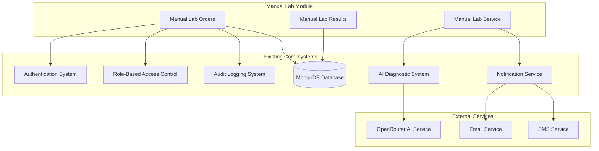
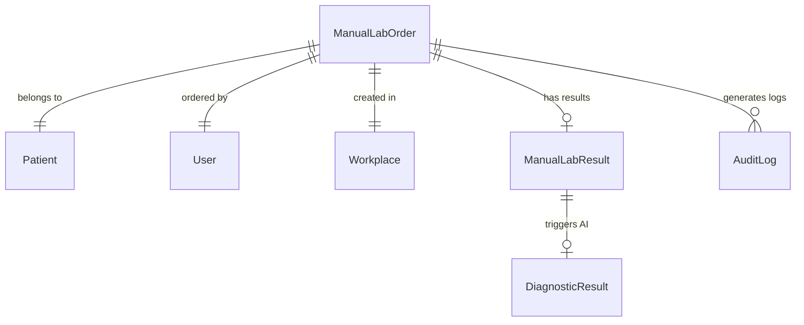

# Manual Lab Order API - Integration Points

## Overview

This document outlines how the Manual Lab Order API integrates with existing systems in the MERN PharmaPilot application. The integration is designed to be non-destructive and additive, leveraging existing infrastructure while maintaining backward compatibility.

## Architecture Integration

### High-Level Integration Map



---

## Core System Integrations

### 1. Authentication System Integration

**Integration Point:** JWT Token Authentication
**Location:** `backend/src/middlewares/auth.ts`

#### How It Works

- Manual Lab API reuses existing JWT authentication middleware
- All endpoints require valid JWT tokens
- Token validation follows existing patterns

#### Code Integration

```typescript
// Manual Lab Routes
import { auth } from '../../../middlewares/auth';

router.use(auth); // Apply to all manual lab routes
```

#### Benefits

- Consistent authentication across the application
- No duplicate authentication logic
- Automatic token validation and user context

### 2. Role-Based Access Control (RBAC) Integration

**Integration Point:** RBAC Middleware
**Location:** `backend/src/middlewares/rbac.ts`

#### How It Works

- Manual Lab endpoints require `pharmacist` or `owner` roles
- Uses existing role validation logic
- Maintains workspace isolation

#### Code Integration

```typescript
import rbac from '../../../middlewares/rbac';

// Require pharmacist or owner role
router.post('/', rbac.requireRole('pharmacist', 'owner'), createManualLabOrder);
```

#### Role Requirements

| Endpoint            | Required Roles        | Notes                  |
| ------------------- | --------------------- | ---------------------- |
| Order Creation      | `pharmacist`, `owner` | Can create orders      |
| Order Management    | `pharmacist`, `owner` | Can view/update orders |
| Result Entry        | `pharmacist`, `owner` | Can enter results      |
| PDF Access          | `pharmacist`, `owner` | Can download PDFs      |
| Security Management | `owner`               | Owner-only operations  |

### 3. Audit Logging System Integration

**Integration Point:** Audit Service
**Location:** `backend/src/services/auditService.ts`

#### How It Works

- All manual lab operations are logged through existing audit system
- Maintains consistent audit trail format
- Integrates with compliance monitoring

#### Code Integration

```typescript
import AuditService from '../../../services/auditService';

// Log order creation
await AuditService.log({
  action: 'manual_lab_order_created',
  resourceType: 'ManualLabOrder',
  resourceId: order.orderId,
  userId: req.user._id,
  workplaceId: order.workplaceId,
  metadata: {
    patientId: order.patientId,
    testCount: order.tests.length,
    priority: order.priority,
  },
});
```

#### Audit Events

- `manual_lab_order_created`
- `manual_lab_order_status_updated`
- `manual_lab_results_entered`
- `manual_lab_pdf_accessed`
- `manual_lab_token_resolved`

### 4. AI Diagnostic System Integration

**Integration Point:** Diagnostic Service
**Location:** `backend/src/modules/diagnostics/services/diagnosticService.ts`

#### How It Works

- Manual lab results trigger AI interpretation automatically
- Reuses existing OpenRouter service integration
- Stores results in existing DiagnosticResult model

#### Code Integration

```typescript
import { diagnosticService } from '../../diagnostics/services/diagnosticService';

// Trigger AI interpretation
const diagnosticRequest: IDiagnosticRequest = {
  patientId: order.patientId,
  workplaceId: order.workplaceId,
  inputSnapshot: {
    symptoms: extractSymptomsFromIndication(order.indication),
    labResults: formatLabResults(labResult.values),
    currentMedications: await getCurrentMedications(order.patientId),
    allergies: await getPatientAllergies(order.patientId),
    demographics: await getPatientDemographics(order.patientId),
  },
  source: 'manual_lab_order',
  sourceId: order.orderId,
};

const diagnosticResult = await diagnosticService.processRequest(
  diagnosticRequest
);
```

#### AI Integration Benefits

- Consistent AI interpretation across all lab results
- Reuses existing AI model configuration
- Maintains diagnostic result history

### 5. Notification System Integration

**Integration Point:** Notification Service
**Location:** `backend/src/services/notificationService.ts`

#### How It Works

- Critical results trigger notifications through existing system
- Respects patient opt-in preferences
- Uses existing SMS/email infrastructure

#### Code Integration

```typescript
import { notificationService } from '../../../services/notificationService';

// Send critical result notification
if (diagnosticResult.redFlags.some((flag) => flag.severity === 'critical')) {
  await notificationService.sendCriticalAlert({
    userId: order.orderedBy,
    type: 'critical_lab_result',
    message: 'Critical lab results require immediate attention',
    data: {
      orderId: order.orderId,
      patientName: patient.getDisplayName(),
      redFlags: diagnosticResult.redFlags.filter(
        (f) => f.severity === 'critical'
      ),
    },
  });
}
```

---

## Database Integration

### 1. MongoDB Collections

#### New Collections

- `manuallaborders` - Manual lab order documents
- `manuallabresults` - Manual lab result documents

#### Existing Collections Used

- `patients` - Patient information
- `users` - Pharmacist/user information
- `workplaces` - Pharmacy/workplace information
- `diagnosticresults` - AI interpretation results
- `auditlogs` - Audit trail entries

### 2. Database Relationships



### 3. Index Strategy

#### Manual Lab Order Indexes

```javascript
// Compound index for workspace and order lookup
db.manuallaborders.createIndex(
  { workplaceId: 1, orderId: 1 },
  { unique: true }
);

// Patient order history
db.manuallaborders.createIndex({ patientId: 1, createdAt: -1 });

// Status-based queries
db.manuallaborders.createIndex({ workplaceId: 1, status: 1 });

// Token resolution
db.manuallaborders.createIndex({ barcodeData: 1 }, { unique: true });
```

---

## External Service Integrations

### 1. OpenRouter AI Service Integration

**Integration Point:** OpenRouter Service
**Location:** `backend/src/services/openRouterService.ts`

#### How It Works

- Manual lab results are formatted for AI interpretation
- Uses existing OpenRouter configuration and API keys
- Maintains consistent AI model usage (DeepSeek V3.1)

#### Configuration Reuse

```typescript
// Reuses existing OpenRouter configuration
const aiResponse = await openRouterService.generateDiagnosticInsight({
  model: 'deepseek/deepseek-v3.1',
  messages: formatLabResultsForAI(labResults, patientData),
  temperature: 0.1,
  max_tokens: 2000,
});
```

### 2. Email Service Integration

**Integration Point:** Email Service
**Location:** `backend/src/services/emailService.ts`

#### How It Works

- Patient notifications use existing email templates
- Maintains consistent branding and formatting
- Respects email preferences and opt-out settings

### 3. SMS Service Integration

**Integration Point:** SMS Service
**Location:** `backend/src/utils/sms.ts`

#### How It Works

- Critical alerts can be sent via SMS
- Uses existing SMS provider configuration
- Follows existing SMS rate limiting and compliance

---

## API Integration Patterns

### 1. Response Format Consistency

Manual Lab API follows existing response patterns:

```typescript
// Success Response (matches existing pattern)
{
  success: true,
  message: "Operation completed successfully",
  data: { /* response data */ }
}

// Error Response (matches existing pattern)
{
  success: false,
  message: "Error description",
  code: "ERROR_CODE",
  details: "Additional details"
}
```

### 2. Middleware Chain Integration

Manual Lab routes use existing middleware:

```typescript
router.use(auth); // Authentication
router.use(setSecurityHeaders); // Security headers
router.use(sanitizeInput); // Input sanitization
router.use(detectSuspiciousActivity); // Security monitoring
router.use(monitorCompliance); // Compliance monitoring
```

### 3. Error Handling Integration

Uses existing error handling patterns:

```typescript
import {
  sendSuccess,
  sendError,
  asyncHandler,
} from '../../../utils/responseHelpers';

export const createManualLabOrder = asyncHandler(async (req, res) => {
  try {
    const order = await ManualLabService.createOrder(orderData);
    sendSuccess(res, { order }, 'Order created successfully', 201);
  } catch (error) {
    if (error.message.includes('validation')) {
      return sendError(res, 'VALIDATION_ERROR', error.message, 400);
    }
    sendError(res, 'SERVER_ERROR', 'Failed to create order', 500);
  }
});
```

---

## Configuration Integration

### 1. Environment Variables

Manual Lab module reuses existing configuration:

```bash
# Database (existing)
MONGODB_URI=mongodb://localhost:27017/PharmaPilot

# JWT (existing)
JWT_SECRET=your_jwt_secret
JWT_EXPIRES_IN=24h

# OpenRouter AI (existing)
OPENROUTER_API_KEY=your_openrouter_key
OPENROUTER_BASE_URL=https://openrouter.ai/api/v1

# Email Service (existing)
EMAIL_SERVICE_API_KEY=your_email_key
EMAIL_FROM_ADDRESS=noreply@PharmaPilot.com

# SMS Service (existing)
SMS_SERVICE_API_KEY=your_sms_key
SMS_FROM_NUMBER=+1234567890

# Manual Lab Specific
MANUAL_LAB_PDF_CACHE_TTL=3600
MANUAL_LAB_TOKEN_EXPIRY=2592000
```

### 2. Feature Flags Integration

Uses existing feature flag system:

```typescript
import { featureFlagService } from '../../../services/featureFlagService';

// Check if manual lab feature is enabled
const isManualLabEnabled = await featureFlagService.isEnabled(
  'manual_lab_orders',
  req.user.workplaceId
);

if (!isManualLabEnabled) {
  return sendError(
    res,
    'FEATURE_DISABLED',
    'Manual lab orders not enabled',
    403
  );
}
```

---

## Security Integration

### 1. Security Middleware Integration

Manual Lab API integrates with existing security measures:

```typescript
// Rate limiting (enhanced for manual lab)
import { enhancedOrderCreationRateLimit } from '../middlewares/manualLabSecurityMiddleware';

// CSRF protection (existing)
import { csrfProtection } from '../../../middlewares/security';

// Input sanitization (existing)
import { sanitizeInput } from '../../../middlewares/security';
```

### 2. Compliance Integration

Integrates with existing compliance monitoring:

```typescript
import { complianceMonitor } from '../../../middlewares/compliance';

// Monitor HIPAA compliance
router.use(
  complianceMonitor({
    resourceType: 'manual_lab_order',
    sensitiveFields: ['patientId', 'indication', 'results'],
    auditLevel: 'detailed',
  })
);
```

---

## Performance Integration

### 1. Caching Integration

Uses existing Redis infrastructure:

```typescript
import { redisClient } from '../../../config/redis';

// Cache test catalog
await redisClient.setex(
  `test_catalog:${workplaceId}`,
  3600,
  JSON.stringify(testCatalog)
);

// Cache PDF
await redisClient.setex(`pdf:${orderId}`, 1800, pdfBuffer);
```

### 2. Database Connection Pooling

Reuses existing MongoDB connection pool:

```typescript
import { connectDB } from '../../../config/db';

// Uses existing connection pool
const db = await connectDB();
```

---

## Monitoring Integration

### 1. Logging Integration

Uses existing logging infrastructure:

```typescript
import logger from '../../../utils/logger';

logger.info('Manual lab order created', {
  orderId: order.orderId,
  patientId: order.patientId,
  workplaceId: order.workplaceId,
  service: 'manual-lab-api',
});
```

### 2. Metrics Integration

Integrates with existing metrics collection:

```typescript
import { metricsCollector } from '../../../utils/metrics';

// Track API performance
metricsCollector.increment('manual_lab.orders.created');
metricsCollector.timing('manual_lab.pdf.generation_time', generationTime);
metricsCollector.gauge('manual_lab.orders.active', activeOrderCount);
```

---

## Testing Integration

### 1. Test Infrastructure Integration

Uses existing test setup:

```typescript
// Test database connection
import { connectTestDB, clearTestDB } from '../../../__tests__/setup';

// Test authentication
import { generateTestToken } from '../../../__tests__/utils/auth';

// Test data factories
import {
  createTestPatient,
  createTestUser,
} from '../../../__tests__/factories';
```

### 2. Mock Service Integration

Reuses existing service mocks:

```typescript
// Mock AI service
jest.mock('../../../services/openRouterService');

// Mock notification service
jest.mock('../../../services/notificationService');

// Mock audit service
jest.mock('../../../services/auditService');
```

---

## Deployment Integration

### 1. CI/CD Pipeline Integration

Manual Lab module integrates with existing deployment pipeline:

```yaml
# .github/workflows/deploy.yml (existing)
- name: Run Manual Lab Tests
  run: npm test -- --testPathPattern=manual-lab

- name: Build Manual Lab Module
  run: npm run build:manual-lab

- name: Deploy Manual Lab Routes
  run: npm run deploy:manual-lab
```

### 2. Environment Configuration

Uses existing environment management:

```bash
# Production environment (existing .env structure)
NODE_ENV=production
MANUAL_LAB_ENABLED=true
MANUAL_LAB_PDF_STORAGE=s3
MANUAL_LAB_AI_TIMEOUT=30000
```

---

## Migration Strategy

### 1. Database Migrations

Manual Lab collections are created through existing migration system:

```typescript
// migrations/createManualLabCollections.ts
export async function up(db: Db) {
  // Create manual lab orders collection
  await db.createCollection('manuallaborders');

  // Create indexes
  await db
    .collection('manuallaborders')
    .createIndex({ workplaceId: 1, orderId: 1 }, { unique: true });
}
```

### 2. Feature Rollout

Uses existing feature flag system for gradual rollout:

```typescript
// Enable for specific workplaces first
await featureFlagService.enableForWorkplace('manual_lab_orders', workplaceId);

// Monitor and gradually expand
await featureFlagService.enableForPercentage('manual_lab_orders', 25);
```

---

## Backward Compatibility

### 1. Existing FHIR Lab Integration

Manual Lab API coexists with existing FHIR lab integration:

- Different route prefixes (`/api/manual-lab-orders` vs `/api/lab-orders`)
- Separate database collections
- No modification to existing FHIR code
- Shared patient and user models

### 2. API Versioning

Follows existing API versioning strategy:

```typescript
// v1 routes (existing)
app.use('/api/v1/lab-orders', fhirLabRoutes);

// Manual lab routes (new)
app.use('/api/manual-lab-orders', manualLabRoutes);
```

---

## Benefits of Integration Approach

### 1. Code Reuse

- Reduces development time
- Maintains consistency
- Leverages existing testing and validation

### 2. Operational Efficiency

- Single authentication system
- Unified audit trails
- Consistent monitoring and alerting

### 3. User Experience

- Familiar interface patterns
- Consistent error handling
- Integrated notifications

### 4. Maintenance

- Centralized configuration
- Shared security updates
- Unified deployment process

---

## Future Integration Opportunities

### 1. Enhanced AI Integration

- Cross-reference with existing lab results
- Trend analysis across manual and FHIR labs
- Predictive analytics for lab ordering patterns

### 2. Advanced Reporting

- Unified reporting across all lab types
- Compliance reporting integration
- Performance analytics dashboard

### 3. Mobile App Integration

- Native mobile scanning capabilities
- Offline result entry synchronization
- Push notification integration

### 4. Third-Party Integrations

- Laboratory information systems (LIS)
- Electronic health records (EHR)
- Pharmacy management systems (PMS)
