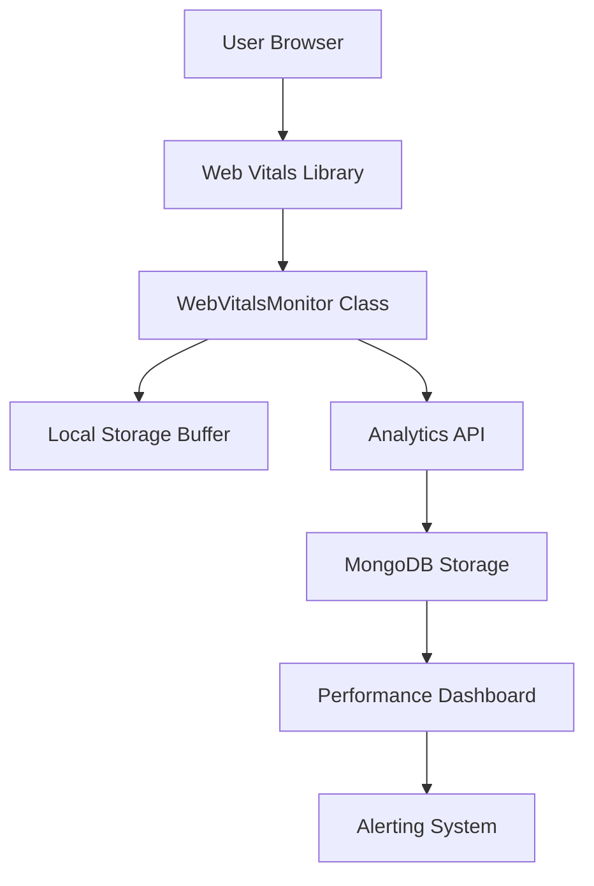
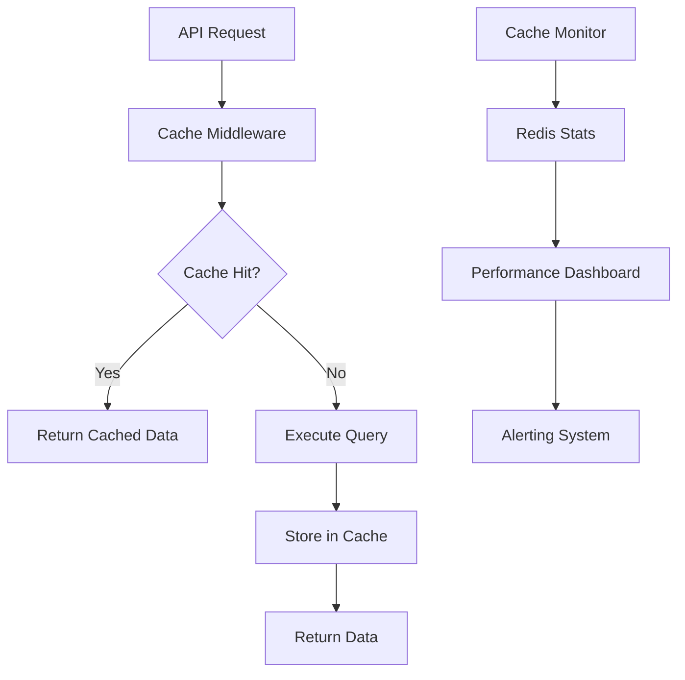

# Performance Monitoring and Maintenance Guide

## Overview

This comprehensive guide provides detailed instructions for monitoring, maintaining, and optimizing the performance of the PharmaPilot MERN-stack SaaS application. It covers Web Vitals monitoring, Lighthouse CI maintenance, Redis cache management, database performance optimization, and performance budget management.

## Web Vitals Monitoring Setup and Interpretation

### Web Vitals Collection System

#### Implementation Architecture


#### Setup Instructions

1. **Frontend Web Vitals Collection**
   ```typescript
   // File: frontend/src/utils/WebVitalsMonitor.ts
   import { getCLS, getFID, getFCP, getLCP, getTTFB, onINP } from 'web-vitals';

   class WebVitalsMonitor {
     private metrics: Map<string, number> = new Map();
     private buffer: WebVitalMetric[] = [];
     
     constructor() {
       this.initializeMetrics();
       this.setupPeriodicReporting();
     }

     private initializeMetrics() {
       getCLS(this.handleMetric.bind(this));
       getFID(this.handleMetric.bind(this));
       getFCP(this.handleMetric.bind(this));
       getLCP(this.handleMetric.bind(this));
       getTTFB(this.handleMetric.bind(this));
       onINP(this.handleMetric.bind(this));
     }

     private handleMetric(metric: any) {
       this.metrics.set(metric.name, metric.value);
       this.buffer.push({
         name: metric.name,
         value: metric.value,
         id: metric.id,
         timestamp: Date.now(),
         url: window.location.href,
         userAgent: navigator.userAgent,
       });

       this.checkPerformanceBudgets(metric);
       
       if (this.buffer.length >= 10) {
         this.flushBuffer();
       }
     }
   }
   ```

2. **Backend Web Vitals API**
   ```typescript
   // File: backend/src/routes/analyticsRoutes.ts
   router.post('/web-vitals', async (req, res) => {
     try {
       const metrics = req.body.metrics;
       
       // Store in MongoDB
       await WebVitalMetric.insertMany(metrics);
       
       // Update real-time aggregations
       await updateWebVitalsAggregations(metrics);
       
       res.status(200).json({ success: true });
     } catch (error) {
       logger.error('Web Vitals storage error:', error);
       res.status(500).json({ error: 'Failed to store metrics' });
     }
   });
   ```

#### Web Vitals Interpretation Guide

**Core Web Vitals Thresholds**:
- **LCP (Largest Contentful Paint)**:
  - Good: ≤ 2.5s
  - Needs Improvement: 2.5s - 4.0s
  - Poor: > 4.0s

- **FID (First Input Delay)**:
  - Good: ≤ 100ms
  - Needs Improvement: 100ms - 300ms
  - Poor: > 300ms

- **CLS (Cumulative Layout Shift)**:
  - Good: ≤ 0.1
  - Needs Improvement: 0.1 - 0.25
  - Poor: > 0.25

**Additional Metrics**:
- **FCP (First Contentful Paint)**: Target ≤ 1.8s
- **TTFB (Time to First Byte)**: Target ≤ 800ms
- **INP (Interaction to Next Paint)**: Target ≤ 200ms

#### Monitoring Dashboard Access
```bash
# Access Web Vitals dashboard
http://localhost:3000/dashboard/performance/web-vitals

# API endpoints for metrics
GET /api/analytics/web-vitals/summary
GET /api/analytics/web-vitals/trends
GET /api/analytics/web-vitals/percentiles
```

#### Web Vitals Troubleshooting

**Common Issues and Solutions**:

1. **High LCP (> 2.5s)**
   - **Causes**: Large images, slow server response, render-blocking resources
   - **Solutions**: 
     ```bash
     # Optimize images
     npm run optimize:images
     
     # Check server response times
     curl -w "@curl-format.txt" -o /dev/null -s "http://localhost:3000"
     
     # Analyze critical rendering path
     npm run lighthouse -- --only-categories=performance
     ```

2. **High FID (> 100ms)**
   - **Causes**: Heavy JavaScript execution, long tasks
   - **Solutions**:
     ```bash
     # Analyze bundle size
     npm run bundle:analyze
     
     # Check for long tasks
     npm run test:performance:long-tasks
     
     # Optimize JavaScript execution
     npm run optimize:js
     ```

3. **High CLS (> 0.1)**
   - **Causes**: Images without dimensions, dynamic content insertion
   - **Solutions**:
     ```bash
     # Test layout stability
     npm run test:visual:layout-shift
     
     # Check image dimensions
     npm run audit:images
     
     # Validate font loading
     npm run audit:fonts
     ```

## Lighthouse CI Maintenance and Troubleshooting

### Lighthouse CI Configuration

#### GitHub Actions Setup
```yaml
# File: .github/workflows/lighthouse-ci.yml
name: Lighthouse CI
on:
  pull_request:
    branches: [main]
  push:
    branches: [main]
  schedule:
    - cron: '0 2 * * *'  # Daily at 2 AM

jobs:
  lighthouse:
    runs-on: ubuntu-latest
    steps:
      - uses: actions/checkout@v3
      
      - name: Setup Node.js
        uses: actions/setup-node@v3
        with:
          node-version: '18'
          cache: 'npm'
      
      - name: Install dependencies
        run: |
          cd frontend
          npm ci
      
      - name: Build application
        run: |
          cd frontend
          npm run build
      
      - name: Run Lighthouse CI
        uses: treosh/lighthouse-ci-action@v9
        with:
          configPath: './lighthouserc.json'
          uploadArtifacts: true
          temporaryPublicStorage: true
        env:
          LHCI_GITHUB_APP_TOKEN: ${{ secrets.LHCI_GITHUB_APP_TOKEN }}
```

#### Lighthouse Configuration
```json
// File: lighthouserc.json
{
  "ci": {
    "collect": {
      "url": [
        "http://localhost:3000",
        "http://localhost:3000/dashboard",
        "http://localhost:3000/patients",
        "http://localhost:3000/clinical-notes"
      ],
      "startServerCommand": "npm run preview",
      "numberOfRuns": 3,
      "settings": {
        "chromeFlags": "--no-sandbox --headless",
        "preset": "desktop",
        "throttling": {
          "rttMs": 40,
          "throughputKbps": 10240,
          "cpuSlowdownMultiplier": 1
        }
      }
    },
    "assert": {
      "assertions": {
        "categories:performance": ["error", {"minScore": 0.9}],
        "categories:accessibility": ["error", {"minScore": 0.95}],
        "categories:best-practices": ["error", {"minScore": 0.9}],
        "categories:seo": ["error", {"minScore": 0.9}],
        "first-contentful-paint": ["error", {"maxNumericValue": 1800}],
        "largest-contentful-paint": ["error", {"maxNumericValue": 2500}],
        "cumulative-layout-shift": ["error", {"maxNumericValue": 0.1}],
        "total-blocking-time": ["error", {"maxNumericValue": 200}]
      }
    },
    "upload": {
      "target": "temporary-public-storage"
    }
  }
}
```

### Lighthouse CI Maintenance Tasks

#### Daily Maintenance
```bash
#!/bin/bash
# scripts/lighthouse-daily-maintenance.sh

echo "Starting Lighthouse CI daily maintenance..."

# Check Lighthouse CI status
lhci healthcheck

# Review recent reports
lhci collect --url=http://localhost:3000 --numberOfRuns=1

# Check for performance regressions
node scripts/check-lighthouse-regressions.js

# Update performance budgets if needed
node scripts/update-performance-budgets.js

echo "Lighthouse CI daily maintenance completed"
```

#### Weekly Maintenance
```bash
#!/bin/bash
# scripts/lighthouse-weekly-maintenance.sh

echo "Starting Lighthouse CI weekly maintenance..."

# Generate weekly performance report
lhci collect --url=http://localhost:3000 --numberOfRuns=5
node scripts/generate-weekly-lighthouse-report.js

# Clean up old reports (keep last 30 days)
lhci cleanup --days=30

# Update Lighthouse version if available
npm update @lhci/cli

# Test configuration changes
lhci assert --preset=lighthouse:recommended

echo "Lighthouse CI weekly maintenance completed"
```

### Lighthouse Troubleshooting

#### Common Issues and Solutions

1. **Lighthouse CI Failing in GitHub Actions**
   ```bash
   # Debug Lighthouse CI issues
   lhci collect --debug
   
   # Check server startup
   npm run preview &
   sleep 10
   curl -I http://localhost:3000
   
   # Validate configuration
   lhci assert --dry-run
   ```

2. **Performance Score Fluctuations**
   ```bash
   # Increase number of runs for stability
   # In lighthouserc.json:
   "numberOfRuns": 5
   
   # Use consistent environment
   "settings": {
     "chromeFlags": "--no-sandbox --headless --disable-dev-shm-usage"
   }
   ```

3. **Budget Violations**
   ```bash
   # Analyze specific metrics
   lhci collect --url=http://localhost:3000 --audit-mode
   
   # Generate detailed report
   lighthouse http://localhost:3000 --output=html --output-path=./lighthouse-report.html
   
   # Check specific optimizations
   npm run analyze:performance
   ```

## Redis Cache Monitoring and Maintenance

### Redis Cache Architecture


### Redis Monitoring Setup

#### Cache Performance Metrics
```typescript
// File: backend/src/services/PerformanceCacheService.ts
class PerformanceCacheService {
  private redis: Redis;
  private metrics: CacheMetrics;

  async getCacheStats(): Promise<CacheStats> {
    const info = await this.redis.info('stats');
    const memory = await this.redis.info('memory');
    
    return {
      hitRate: this.calculateHitRate(),
      missRate: this.calculateMissRate(),
      memoryUsage: this.parseMemoryUsage(memory),
      keyCount: await this.redis.dbsize(),
      evictions: this.parseEvictions(info),
      connections: await this.redis.client('list'),
    };
  }

  private calculateHitRate(): number {
    const hits = this.metrics.hits || 0;
    const misses = this.metrics.misses || 0;
    const total = hits + misses;
    return total > 0 ? (hits / total) * 100 : 0;
  }
}
```

#### Cache Monitoring Dashboard
```bash
# Access Redis monitoring dashboard
http://localhost:3000/admin/performance/cache

# API endpoints for cache metrics
GET /api/admin/performance/cache/stats
GET /api/admin/performance/cache/keys
GET /api/admin/performance/cache/memory
```

### Redis Maintenance Procedures

#### Daily Cache Maintenance
```bash
#!/bin/bash
# scripts/redis-daily-maintenance.sh

echo "Starting Redis daily maintenance..."

# Check Redis health
redis-cli ping

# Monitor memory usage
redis-cli info memory | grep used_memory_human

# Check hit rate
redis-cli info stats | grep keyspace_hits

# Clean expired keys
redis-cli --scan --pattern "*:expired:*" | xargs redis-cli del

# Monitor slow queries
redis-cli slowlog get 10

echo "Redis daily maintenance completed"
```

#### Weekly Cache Maintenance
```bash
#!/bin/bash
# scripts/redis-weekly-maintenance.sh

echo "Starting Redis weekly maintenance..."

# Analyze memory usage patterns
redis-cli --bigkeys

# Check for memory leaks
redis-cli info memory | grep used_memory_peak_human

# Optimize cache configuration
node scripts/optimize-redis-config.js

# Backup Redis data
redis-cli --rdb /backup/redis-$(date +%Y%m%d).rdb

# Test cache performance
node scripts/test-cache-performance.js

echo "Redis weekly maintenance completed"
```

#### Cache Performance Optimization
```typescript
// Optimal cache configuration
const cacheConfig = {
  // TTL strategies by data type
  userProfile: 15 * 60, // 15 minutes
  dashboardData: 5 * 60, // 5 minutes
  patientList: 2 * 60, // 2 minutes
  staticData: 60 * 60, // 1 hour
  
  // Memory management
  maxMemoryPolicy: 'allkeys-lru',
  maxMemory: '512mb',
  
  // Performance settings
  tcpKeepAlive: 60,
  tcpNoDelay: true,
  
  // Monitoring
  slowlogLogSlowerThan: 10000, // 10ms
  slowlogMaxLen: 128,
};
```

### Cache Troubleshooting

#### Common Cache Issues

1. **Low Hit Rate (< 70%)**
   ```bash
   # Analyze cache patterns
   redis-cli --hotkeys
   
   # Check TTL settings
   redis-cli --scan --pattern "*" | head -20 | xargs redis-cli ttl
   
   # Monitor cache invalidation
   redis-cli monitor | grep -E "(del|expire|flushdb)"
   ```

2. **High Memory Usage**
   ```bash
   # Find large keys
   redis-cli --bigkeys
   
   # Analyze memory usage
   redis-cli memory usage <key>
   
   # Check for memory leaks
   redis-cli info memory | grep -E "(used_memory|mem_fragmentation)"
   ```

3. **Connection Issues**
   ```bash
   # Check connection pool
   redis-cli client list
   
   # Monitor connection count
   redis-cli info clients
   
   # Test connection performance
   redis-cli --latency -i 1
   ```

## Database Performance Monitoring and Optimization

### MongoDB Performance Monitoring

#### Database Profiling Setup
```typescript
// File: backend/src/services/DatabaseProfiler.ts
class DatabaseProfiler {
  async enableProfiling(slowms: number = 100) {
    await mongoose.connection.db.runCommand({
      profile: 2, // Profile all operations
      slowms: slowms,
      sampleRate: 1.0
    });
  }

  async getSlowQueries(hours: number = 1): Promise<SlowQuery[]> {
    const since = new Date(Date.now() - hours * 60 * 60 * 1000);
    
    return await mongoose.connection.db
      .collection('system.profile')
      .find({
        ts: { $gte: since },
        millis: { $gte: 100 }
      })
      .sort({ ts: -1 })
      .limit(100)
      .toArray();
  }

  async getIndexUsage(): Promise<IndexUsage[]> {
    const collections = await mongoose.connection.db.listCollections().toArray();
    const indexUsage = [];

    for (const collection of collections) {
      const stats = await mongoose.connection.db
        .collection(collection.name)
        .aggregate([{ $indexStats: {} }])
        .toArray();
      
      indexUsage.push({
        collection: collection.name,
        indexes: stats
      });
    }

    return indexUsage;
  }
}
```

#### Database Monitoring Dashboard
```bash
# Access database monitoring dashboard
http://localhost:3000/admin/performance/database

# API endpoints for database metrics
GET /api/admin/performance/database/profile
GET /api/admin/performance/database/indexes
GET /api/admin/performance/database/stats
```

### Database Maintenance Procedures

#### Daily Database Maintenance
```bash
#!/bin/bash
# scripts/database-daily-maintenance.sh

echo "Starting database daily maintenance..."

# Check database health
mongo $MONGODB_URI --eval "db.runCommand('ping')"

# Monitor slow queries
mongo $MONGODB_URI --eval "db.system.profile.find().limit(10).sort({ts:-1}).pretty()"

# Check index usage
mongo $MONGODB_URI --eval "db.runCommand('collStats', 'patients')"

# Monitor connection pool
mongo $MONGODB_URI --eval "db.runCommand('serverStatus').connections"

# Check replication lag (if applicable)
mongo $MONGODB_URI --eval "rs.printSlaveReplicationInfo()"

echo "Database daily maintenance completed"
```

#### Weekly Database Maintenance
```bash
#!/bin/bash
# scripts/database-weekly-maintenance.sh

echo "Starting database weekly maintenance..."

# Analyze query patterns
mongo $MONGODB_URI --eval "db.system.profile.aggregate([
  {\$group: {_id: '\$command.find', count: {\$sum: 1}, avgMs: {\$avg: '\$millis'}}},
  {\$sort: {count: -1}},
  {\$limit: 10}
])"

# Check index effectiveness
node scripts/analyze-index-usage.js

# Optimize collections
mongo $MONGODB_URI --eval "db.runCommand('compact', 'patients')"

# Update database statistics
mongo $MONGODB_URI --eval "db.runCommand('reIndex', 'patients')"

# Backup database
mongodump --uri="$MONGODB_URI" --out="/backup/$(date +%Y%m%d)"

echo "Database weekly maintenance completed"
```

#### Database Optimization Scripts
```javascript
// scripts/optimize-database-indexes.js
const optimizeIndexes = async () => {
  // Analyze query patterns
  const slowQueries = await analyzeSlowQueries();
  
  // Suggest new indexes
  const indexSuggestions = await generateIndexSuggestions(slowQueries);
  
  // Create recommended indexes
  for (const suggestion of indexSuggestions) {
    if (suggestion.score > 0.8) {
      await createIndex(suggestion.collection, suggestion.index);
    }
  }
  
  // Remove unused indexes
  const unusedIndexes = await findUnusedIndexes();
  for (const index of unusedIndexes) {
    if (index.usage < 0.1) {
      await dropIndex(index.collection, index.name);
    }
  }
};
```

### Database Troubleshooting

#### Common Database Issues

1. **Slow Queries (> 100ms)**
   ```bash
   # Enable profiling
   mongo $MONGODB_URI --eval "db.setProfilingLevel(2, {slowms: 50})"
   
   # Analyze slow queries
   mongo $MONGODB_URI --eval "db.system.profile.find({millis: {\$gt: 100}}).sort({ts: -1}).limit(10)"
   
   # Check explain plans
   mongo $MONGODB_URI --eval "db.patients.find({workspaceId: ObjectId('...')}).explain('executionStats')"
   ```

2. **High CPU Usage**
   ```bash
   # Check current operations
   mongo $MONGODB_URI --eval "db.currentOp()"
   
   # Monitor resource usage
   mongo $MONGODB_URI --eval "db.runCommand('serverStatus').opcounters"
   
   # Analyze index usage
   mongo $MONGODB_URI --eval "db.patients.aggregate([{\$indexStats: {}}])"
   ```

3. **Connection Pool Exhaustion**
   ```bash
   # Check connection stats
   mongo $MONGODB_URI --eval "db.runCommand('serverStatus').connections"
   
   # Monitor connection pool
   node -e "console.log(mongoose.connection.readyState)"
   
   # Optimize connection settings
   # In connection string: ?maxPoolSize=10&minPoolSize=5
   ```

## Performance Budget Management and Alerting

### Performance Budget Configuration

#### Budget Definition
```json
// File: performance-budgets.json
{
  "lighthouse": {
    "performance": {
      "desktop": 90,
      "mobile": 80
    },
    "accessibility": 95,
    "bestPractices": 90,
    "seo": 90
  },
  "webVitals": {
    "lcp": 2500,
    "fid": 100,
    "cls": 0.1,
    "fcp": 1800,
    "ttfb": 800,
    "inp": 200
  },
  "bundleSize": {
    "totalGzip": 512000,
    "mainChunkGzip": 204800,
    "vendorChunkGzip": 256000,
    "individualChunkGzip": 102400
  },
  "api": {
    "p50Latency": 200,
    "p95Latency": 500,
    "p99Latency": 1000,
    "errorRate": 1
  },
  "database": {
    "queryTimeP95": 100,
    "connectionPoolUtilization": 80,
    "slowQueriesPerHour": 10,
    "indexHitRatio": 95
  },
  "cache": {
    "hitRate": 80,
    "memoryUtilization": 80,
    "evictionRate": 5
  }
}
```

#### Budget Validation Service
```typescript
// File: backend/src/services/PerformanceBudgetService.ts
class PerformanceBudgetService {
  private budgets: PerformanceBudgets;

  async validateBudgets(): Promise<BudgetValidationResult> {
    const results = {
      lighthouse: await this.validateLighthouseBudgets(),
      webVitals: await this.validateWebVitalsBudgets(),
      bundleSize: await this.validateBundleSizeBudgets(),
      api: await this.validateAPIBudgets(),
      database: await this.validateDatabaseBudgets(),
      cache: await this.validateCacheBudgets(),
    };

    const violations = this.findBudgetViolations(results);
    
    if (violations.length > 0) {
      await this.sendBudgetViolationAlerts(violations);
    }

    return {
      passed: violations.length === 0,
      violations,
      results
    };
  }

  private async validateWebVitalsBudgets(): Promise<WebVitalsBudgetResult> {
    const metrics = await this.getLatestWebVitals();
    
    return {
      lcp: {
        value: metrics.lcp.p75,
        budget: this.budgets.webVitals.lcp,
        passed: metrics.lcp.p75 <= this.budgets.webVitals.lcp
      },
      fid: {
        value: metrics.fid.p75,
        budget: this.budgets.webVitals.fid,
        passed: metrics.fid.p75 <= this.budgets.webVitals.fid
      },
      cls: {
        value: metrics.cls.p75,
        budget: this.budgets.webVitals.cls,
        passed: metrics.cls.p75 <= this.budgets.webVitals.cls
      }
    };
  }
}
```

### Alerting System Configuration

#### Alert Rules Configuration
```yaml
# File: monitoring/alert_rules.yml
groups:
  - name: performance_budgets
    rules:
      - alert: LighthousePerformanceRegression
        expr: lighthouse_performance_score < 90
        for: 5m
        labels:
          severity: warning
          component: frontend
        annotations:
          summary: "Lighthouse performance score below budget"
          description: "Performance score: {{ $value }}, Budget: 90"

      - alert: WebVitalsLCPViolation
        expr: web_vitals_lcp_p75 > 2500
        for: 2m
        labels:
          severity: warning
          component: frontend
        annotations:
          summary: "LCP exceeds performance budget"
          description: "LCP P75: {{ $value }}ms, Budget: 2500ms"

      - alert: APILatencyViolation
        expr: api_response_time_p95 > 500
        for: 3m
        labels:
          severity: warning
          component: backend
        annotations:
          summary: "API latency exceeds budget"
          description: "P95 latency: {{ $value }}ms, Budget: 500ms"

      - alert: BundleSizeViolation
        expr: bundle_size_gzip > 512000
        for: 1m
        labels:
          severity: warning
          component: frontend
        annotations:
          summary: "Bundle size exceeds budget"
          description: "Bundle size: {{ $value }} bytes, Budget: 512KB"

      - alert: CacheHitRateViolation
        expr: cache_hit_rate < 80
        for: 5m
        labels:
          severity: warning
          component: cache
        annotations:
          summary: "Cache hit rate below budget"
          description: "Hit rate: {{ $value }}%, Budget: 80%"
```

#### Notification Channels
```typescript
// File: backend/src/services/PerformanceAlertService.ts
class PerformanceAlertService {
  async sendAlert(alert: PerformanceAlert): Promise<void> {
    const channels = this.getAlertChannels(alert.severity);
    
    for (const channel of channels) {
      switch (channel.type) {
        case 'slack':
          await this.sendSlackAlert(channel, alert);
          break;
        case 'email':
          await this.sendEmailAlert(channel, alert);
          break;
        case 'webhook':
          await this.sendWebhookAlert(channel, alert);
          break;
      }
    }
  }

  private async sendSlackAlert(channel: SlackChannel, alert: PerformanceAlert): Promise<void> {
    const message = {
      text: `🚨 Performance Alert: ${alert.title}`,
      attachments: [{
        color: this.getAlertColor(alert.severity),
        fields: [
          { title: 'Component', value: alert.component, short: true },
          { title: 'Severity', value: alert.severity, short: true },
          { title: 'Current Value', value: alert.currentValue, short: true },
          { title: 'Budget', value: alert.budget, short: true },
          { title: 'Description', value: alert.description, short: false }
        ],
        footer: 'Performance Monitoring System',
        ts: Math.floor(Date.now() / 1000)
      }]
    };

    await this.slackClient.chat.postMessage({
      channel: channel.channelId,
      ...message
    });
  }
}
```

### Performance Budget Dashboard

#### Dashboard Components
```typescript
// File: frontend/src/components/PerformanceBudgetDashboard.tsx
const PerformanceBudgetDashboard = () => {
  const { data: budgetStatus } = useQuery({
    queryKey: ['performance', 'budgets'],
    queryFn: () => api.getPerformanceBudgetStatus(),
    refetchInterval: 30000, // Refresh every 30 seconds
  });

  return (
    <div className="performance-budget-dashboard">
      <div className="budget-overview">
        <BudgetStatusCard
          title="Lighthouse Performance"
          current={budgetStatus.lighthouse.performance.current}
          budget={budgetStatus.lighthouse.performance.budget}
          status={budgetStatus.lighthouse.performance.status}
        />
        
        <BudgetStatusCard
          title="Web Vitals LCP"
          current={budgetStatus.webVitals.lcp.current}
          budget={budgetStatus.webVitals.lcp.budget}
          status={budgetStatus.webVitals.lcp.status}
        />
        
        <BudgetStatusCard
          title="API Latency P95"
          current={budgetStatus.api.p95Latency.current}
          budget={budgetStatus.api.p95Latency.budget}
          status={budgetStatus.api.p95Latency.status}
        />
      </div>
      
      <div className="budget-trends">
        <PerformanceTrendChart data={budgetStatus.trends} />
      </div>
      
      <div className="budget-violations">
        <BudgetViolationsList violations={budgetStatus.violations} />
      </div>
    </div>
  );
};
```

### Maintenance Schedules and Procedures

#### Daily Performance Maintenance Checklist
```bash
#!/bin/bash
# scripts/daily-performance-maintenance.sh

echo "=== Daily Performance Maintenance ==="
echo "Date: $(date)"

# 1. Check performance budgets
echo "Checking performance budgets..."
curl -s http://localhost:5000/api/admin/performance/budgets/validate | jq .

# 2. Review Web Vitals
echo "Reviewing Web Vitals..."
curl -s http://localhost:5000/api/analytics/web-vitals/summary | jq .

# 3. Check API performance
echo "Checking API performance..."
curl -s http://localhost:5000/api/admin/performance/latency | jq .

# 4. Monitor cache performance
echo "Monitoring cache performance..."
curl -s http://localhost:5000/api/admin/performance/cache/stats | jq .

# 5. Check database performance
echo "Checking database performance..."
curl -s http://localhost:5000/api/admin/performance/database/profile | jq .

# 6. Review alerts
echo "Reviewing recent alerts..."
curl -s http://localhost:5000/api/admin/alerts/recent | jq .

echo "Daily performance maintenance completed"
```

#### Weekly Performance Review
```bash
#!/bin/bash
# scripts/weekly-performance-review.sh

echo "=== Weekly Performance Review ==="
echo "Week ending: $(date)"

# Generate comprehensive performance report
node scripts/generate-weekly-performance-report.js

# Update performance baselines
node scripts/update-performance-baselines.js

# Review and update budgets
node scripts/review-performance-budgets.js

# Analyze performance trends
node scripts/analyze-performance-trends.js

# Plan optimization improvements
node scripts/generate-optimization-recommendations.js

echo "Weekly performance review completed"
```

#### Monthly Performance Audit
```bash
#!/bin/bash
# scripts/monthly-performance-audit.sh

echo "=== Monthly Performance Audit ==="
echo "Month ending: $(date)"

# Comprehensive Lighthouse audit
npm run lighthouse:comprehensive

# Full load testing
./scripts/run-comprehensive-load-tests.sh

# Database performance analysis
node scripts/comprehensive-database-analysis.js

# Cache optimization review
node scripts/cache-optimization-review.js

# Performance documentation update
node scripts/update-performance-documentation.js

# Team performance review meeting preparation
node scripts/prepare-performance-review-meeting.js

echo "Monthly performance audit completed"
```

## Troubleshooting Common Performance Issues

### Performance Issue Diagnosis Workflow

1. **Identify the Issue**
   - Check monitoring dashboards
   - Review recent alerts
   - Analyze user reports

2. **Gather Data**
   - Collect performance metrics
   - Review application logs
   - Check infrastructure metrics

3. **Analyze Root Cause**
   - Use performance profiling tools
   - Analyze database queries
   - Review code changes

4. **Implement Solution**
   - Apply targeted optimizations
   - Test performance improvements
   - Monitor for regressions

5. **Validate Resolution**
   - Confirm metrics improvement
   - Verify user experience
   - Update documentation

### Common Performance Problems and Solutions

#### Frontend Performance Issues

1. **Slow Page Load Times**
   ```bash
   # Diagnose with Lighthouse
   lighthouse http://localhost:3000 --output=html
   
   # Check bundle size
   npm run bundle:analyze
   
   # Analyze critical rendering path
   npm run analyze:critical-path
   ```

2. **Poor Web Vitals Scores**
   ```bash
   # Test Web Vitals locally
   npm run test:web-vitals
   
   # Check for layout shifts
   npm run test:layout-shift
   
   # Analyze long tasks
   npm run analyze:long-tasks
   ```

#### Backend Performance Issues

1. **High API Latency**
   ```bash
   # Profile API endpoints
   curl -w "@curl-format.txt" http://localhost:5000/api/patients
   
   # Check database queries
   node scripts/analyze-slow-queries.js
   
   # Monitor cache performance
   redis-cli info stats
   ```

2. **Database Performance Problems**
   ```bash
   # Enable MongoDB profiling
   mongo --eval "db.setProfilingLevel(2, {slowms: 50})"
   
   # Analyze slow queries
   mongo --eval "db.system.profile.find().sort({ts:-1}).limit(10)"
   
   # Check index usage
   node scripts/analyze-index-usage.js
   ```

This comprehensive monitoring and maintenance guide ensures optimal performance of the PharmaPilot application through proactive monitoring, regular maintenance, and systematic troubleshooting procedures.